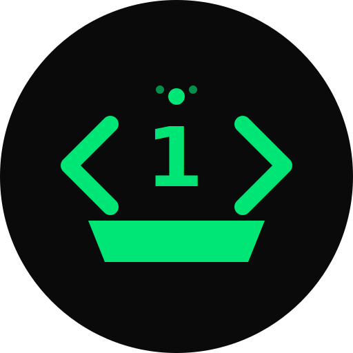

# FirstCode Forge

<div align="center">
  
  
  **Learn coding from first principles with immersive motion design and AI-personalized challenges.**

[](https://nextjs.org/)
[](https://www.typescriptlang.org/)
[](https://tailwindcss.com/)
[](https://www.framer.com/motion/)

[Live Demo](#) · [Report Bug](https://github.com/michojekunle/firstcode-forge/issues) · [Request Feature](https://github.com/michojekunle/firstcode-forge/issues)

</div>

---

## ✨ Features

- **🧠 First-Principles Learning** — Break down complex programming concepts into fundamental truths
- **🎨 Motion Design** — Zajno-inspired animations that make code execution visible and intuitive
- **🤖 AI-Personalized Challenges** — Get unique coding projects tailored to your interests via OpenAI
- **🌓 Dark/Light Mode** — Beautiful theming with a signature green (#00E676) accent
- **📱 Fully Responsive** — Works seamlessly on mobile, tablet, and desktop

---

## 🖼️ Screenshots

### Landing Page


_Staggered 3D text reveal with gradient orbs and glassmorphism_

### Interactive Loop Visualizer


_Watch code execute step-by-step with real-time visualization_

### Onboarding Survey


_Multi-step survey with smooth slide transitions_

### AI-Generated Challenge


_Personalized coding challenge based on your profile_

---

## 🚀 Quick Start

### Prerequisites

- **Node.js** 18+
- **pnpm** (recommended) or npm
- **OpenAI API Key** (for AI challenge generation)

### Installation

```bash
# Clone the repository
git clone https://github.com/michojekunle/firstcode-forge.git
cd firstcode-forge

# Install dependencies
pnpm install

# Set up environment variables
cp .env.example .env.local
# Add your OpenAI API key to .env.local

# Start development server
pnpm dev
```

Open [http://localhost:3000](http://localhost:3000) in your browser.

### Environment Variables

Create a `.env.local` file:

```env
OPENAI_API_KEY=your-openai-api-key-here
```

---

## 📁 Project Structure

```
src/
├── app/
│   ├── page.tsx              # Landing page
│   ├── onboarding/           # Multi-step survey
│   ├── dashboard/            # AI challenge display
│   ├── api/
│   │   └── generate-challenge/ # OpenAI API route
│   ├── layout.tsx            # Root layout
│   └── globals.css           # Design system
├── components/
│   ├── landing/              # Hero, Concept, Features, CTA
│   ├── layout/               # Navbar, Footer
│   ├── providers/            # ThemeProvider
│   └── ui/                   # Button, Card
└── lib/
    ├── store.ts              # Zustand state management
    ├── ai.ts                 # OpenAI integration
    └── utils.ts              # Utility functions
```

---

## 🎨 Design System

### Colors

| Token           | Light     | Dark      |
| --------------- | --------- | --------- |
| Background      | `#FAFAFA` | `#0A0A0A` |
| Foreground      | `#0A0A0A` | `#FAFAFA` |
| Primary (Green) | `#00E676` | `#00E676` |
| Muted           | `#F4F4F5` | `#18181B` |

### Typography

- **Headings**: Space Grotesk
- **Body**: Inter
- **Code**: JetBrains Mono

### Motion Principles

Inspired by [motion.zajno.com](https://motion.zajno.com):

1. **Easing** — `cubic-bezier(0.16, 1, 0.3, 1)` for smooth deceleration
2. **Stagger** — Elements appear sequentially (`staggerChildren: 0.08`)
3. **Spring Physics** — Natural, bouncy interactions

---

## 🛠️ Tech Stack

- **Framework**: [Next.js 16](https://nextjs.org/) with App Router
- **Language**: [TypeScript](https://www.typescriptlang.org/)
- **Styling**: [Tailwind CSS v4](https://tailwindcss.com/)
- **Animation**: [Framer Motion](https://www.framer.com/motion/)
- **State**: [Zustand](https://zustand-demo.pmnd.rs/)
- **AI**: [OpenAI API](https://platform.openai.com/)
- **Icons**: [Lucide React](https://lucide.dev/)

---

## 🖥️ CLI Tool (Coming Soon)

<div align="center">
  <pre>
  ╭──────────────────────────────────────────╮
  │                                          │
  │   $ forge learn python                   │
  │                                          │
  │   🔥 FirstCode Forge CLI                 │
  │                                          │
  │   Learn coding from your terminal with   │
  │   interactive exercises and AI tutoring. │
  │                                          │
  │   Coming Q2 2026                         │
  │                                          │
  ╰──────────────────────────────────────────╯
  </pre>
</div>

The **FirstCode Forge CLI** will bring the first-principles learning experience directly to your terminal:

- **Interactive Lessons** — Step through concepts with visual ASCII animations
- **AI Tutor** — Get instant help and explanations via the command line
- **Offline Mode** — Learn anywhere, even without internet
- **Progress Sync** — Seamlessly sync your progress with the web platform

### Planned Commands

```bash
forge learn <language>    # Start an interactive lesson
forge challenge           # Get a personalized coding challenge
forge progress            # View your learning progress
forge explain <concept>   # AI-powered concept explanation
```

📧 **Join the waitlist**: [Subscribe for updates](#)

---

## 🧪 Development

```bash
# Run development server with Turbopack
pnpm dev

# Build for production
pnpm build

# Start production server
pnpm start

# Run linting
pnpm lint

# Type checking
pnpm typecheck
```

---

## 📝 License

MIT © [FirstCode Forge](https://github.com/michojekunle/firstcode-forge)

---

<div align="center">
  <p>Built with 💚 for learners worldwide</p>
  <p>
    <a href="https://twitter.com/firstcodeforge">Twitter</a> · 
    <a href="https://github.com/michojekunle/firstcode-forge">GitHub</a>
  </p>
</div>
